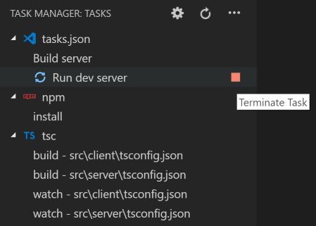

# vscode-task-manager

Manages tasks in Visual Studio Code in a custom activity view.

## Features

- List all detected tasks grouped by sources, and by root folders
  * The task list is automatically refreshed when a common task file is changed (e.g. gulpfile.js)
- Run/terminate tasks directly in the custom activity view
- Running tasks are indicated by an animated icon

### Screenshot

## Known Issues

- No number of running tasks badge on the custom activity icon due to lack of VSCode API ([#62783](https://github.com/Microsoft/vscode/issues/62783))

## Release Notes

### 0.4.2
- Use built-in codicon in commands.
- Fix a bug that doesn't show icon for tasks in execution.

### 0.4.1
- Bundle the extension using webpack.

### 0.4.0
- Use theme icons provided by vscode instead of custom icons for task sources.

### 0.3.0
- Tasks from different root folders in multi-root workspaces are separated.
- Animated running task icon.

### 0.2.0
Updated icons to match the new vscode style.

### 0.1.0
Initial release.

## Credits
- The extension icon (task.svg) is made by [Pixel perfect](https://www.flaticon.com/authors/pixel-perfect) from [Flaticon](https://www.flaticon.com/).
- The sync icon (sync.svg) is made by [Those Icons](https://www.flaticon.com/authors/those-icons) from [Flaticon](https://www.flaticon.com/).
