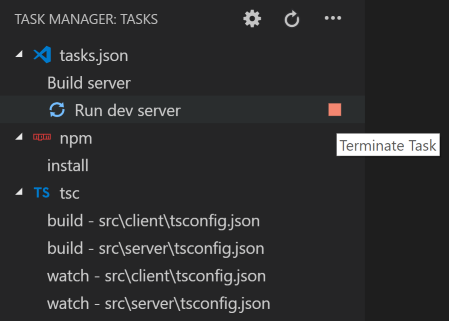

# vscode-task-manager

Manages tasks in Visual Studio Code in a custom activity view.

## Features

- List all detected tasks grouped by sources, and by root folders
  - The task list is automatically refreshed when a common task file is changed (e.g. gulpfile.js)
- Run/terminate/restart tasks directly in the custom activity view
- Keep frequently used tasks in a top-level Favorites group
- Running tasks are indicated by an animated icon
- Total number of running tasks is shown as view badge
- Exclude tasks using a regular expression pattern `taskManager.exclude`
- Automatically collapse large task trees using `taskManager.collapseLargeTaskTree`

### Screenshot

## Release Notes

See [CHANGELOG.md](CHANGELOG.md) for release history.

## Credits

- The extension icon (task.svg) is made by [Pixel perfect](https://www.flaticon.com/authors/pixel-perfect) from [Flaticon](https://www.flaticon.com/).
- The sync icon (sync.svg) is made by [Those Icons](https://www.flaticon.com/authors/those-icons) from [Flaticon](https://www.flaticon.com/).
